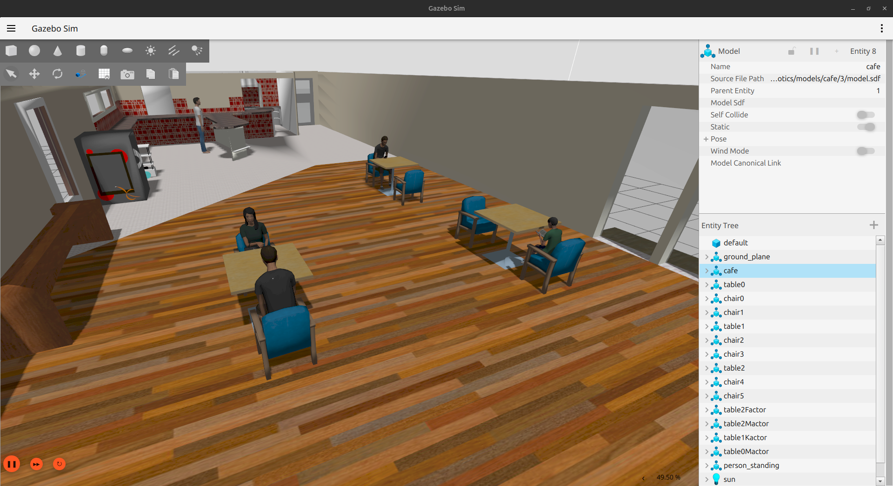

# French Cafe Robot Action Planning

### Working Environment 
- **Ubuntu 24.04**
- **ROS2 Jazzy**


### Package Structure
- [cafe_robot_action_planning](./cafe_robot_action_planning/)
- [cafe_robot_interfaces](./cafe_robot_interfaces/)
  - [cafe_robot_interfaces](./cafe_robot_interfaces/cafe_robot_interfaces/)
    - [order_manager.py](./cafe_robot_interfaces/cafe_robot_interfaces/order_manager.py)
    - [robot_navigator.py](./cafe_robot_interfaces/cafe_robot_interfaces/robot_navigator.py)
  - [config](./cafe_robot_interfaces/config/)
    - [bridge_params.yaml](./cafe_robot_interfaces/config/bridge_params.yaml)
    - [cafe_robot_config.rviz](./cafe_robot_interfaces/config/cafe_robot_config.rviz)
    - [nav2_default_view.rviz](./cafe_robot_interfaces/config/nav2_default_view.rviz)
    - [nav2_params.yaml](./cafe_robot_interfaces/config/nav2_params.yaml)
  - [launch](./cafe_robot_interfaces/launch/)
    - [bringup_launch.py](./cafe_robot_interfaces/launch/bringup_launch.py)
    - [gazebo.launch.py](./cafe_robot_interfaces/launch/gazebo.launch.py)
    - [localization_launch.py](./cafe_robot_interfaces/launch/localization_launch.py)
    - [navigation_launch.py](./cafe_robot_interfaces/launch/navigation_launch.py)
    - [rviz_launch.py](./cafe_robot_interfaces/launch/rviz_launch.py)
  - [maps](./cafe_robot_interfaces/maps/)
    - [cafe_robot.pgm](./cafe_robot_interfaces/maps/cafe_robot.pgm)
    - [cafe_robot.yaml](./cafe_robot_interfaces/maps/cafe_robot.yaml)
  - [resource](./cafe_robot_interfaces/resource/)
  - [robot_description](./cafe_robot_interfaces/robot_description/)
    - [urdf](./cafe_robot_interfaces/robot_description/urdf/)
      - [cafe_robot.urdf.xacro](./cafe_robot_interfaces/robot_description/urdf/cafe_robot.urdf.xacro)
      - [gazebo_plugins.xacro](./cafe_robot_interfaces/robot_description/urdf/gazebo_plugins.xacro)
      - [inertial_macros.xacro](./cafe_robot_interfaces/robot_description/urdf/inertial_macros.xacro)
  - [worlds](./cafe_robot_interfaces/worlds/)
    - [cafe.world](./cafe_robot_interfaces/worlds/cafe.world)
    - [empty.world](./cafe_robot_interfaces/worlds/empty.world)

## Creation of URDF 

- Created basic structure of robot with simple geometry shapes in the [core](./cafe_robot_action_planning/robot_description/urdf/cafe_robot.urdf.xacro) urdf 
- Added inertial xacro for dynamically add inertial for all the links in the robot
- Added xacro for gazebo plugins 
  - Diff drive controller for robot movements [gazebo](./cafe_robot_action_planning/robot_description/urdf/) plugin 
  - gpu-lidar plugin for lidar 
- Created launch and config file visualizing the [robot urdf](./cafe_robot_action_planning/launch/rviz.launch.py) and [config](./cafe_robot_action_planning/config/cafe_robot_config.rviz)


## Environment Creation

- All models are fetched from Gazebo Sim fuel website (https://app.gazebosim.org/fuel/models)
- Created [Cafe environment](./cafe_robot_action_planning/worlds/cafe.world) with custom sdf file
- Modified launch file to add the cafe world as default world
  


## Map Building using slamtoolbox

- Created the environment map with slamtoolbox package 
- Saved map with nav2 map server cli 

  


## Implementation of Navigation 2 
- Created parameter file with robot specific properties like chassis size etc 
- Created the [navigation](./cafe_robot_action_planning/launch/navigation_launch.py) and [localization](./cafe_robot_action_planning/launch/localization_launch.py) launch file 
- For simplicity combined the navigation and localisation files into a launch file [bringup.launch.py](./cafe_robot_action_planning/launch/bringup_launch.py) which initializes the all servers needed for navigation

## Launching the Simulation

#### Gazebo and order manager node

It may take few minutes for the first launch it needs to download the models from the gazebo fuel site

```code
ros2 launch cafe_robot_action_planning gazebo.launch.py use_sim_time:=True
```
#### Rviz2

```code
rviz2 -d path_to_package/config/nav2_default_view.rviz use_sim_time:=true
```

#### Navigation stack 
```code
ros2 launch cafe_robot_action_planning bringup.launch.py use_sim_time:=true
```
*or* 

```code 
ros2 launch cafe_robot_action_planning bringup.launch.py params_file:= path_to_package/config/nav2_params.yaml use_sim_time:=true
```

#### Robot Navigator node

```code 
ros2 run cafe_robot_action_planning robot_navigator --ros-args --remap use_sim_time:=true
```
## Running the Simulation 

After launching the every node, the robot starts to localize the map.

## To place the order 

```code
ros2 service call /order_manager cafe_robot_interfaces/srv/Order "{table_number: <table_number>, request_type: 'place'}"
```
## To confirm the order
```code
ros2 service call /order_manager cafe_robot_interfaces/srv/Order "{table_number: <table_number>, request_type= 'update',status = 'confirm'}""
```

**Note : Replace the path_to_package to your saved package location & follow the sequence order to launch the files**

### Completed Tasks 

- [x] All confirmation - [Demo Video](https://drive.google.com/file/d/13cnn5r5En75oTlICvUAAreVMN740Y1ZH/view?usp=sharing)
- [x] Kitchen Timeout - [Demo Video](https://drive.google.com/file/d/1gbKPs_Z_bu9vf_ctNup0lEPHf4M_PuHu/view?usp=sharing)
- [x] Table Timeout - [Demo Video](https://drive.google.com/file/d/12aKdaSzQb7H8-9MI3qh9AY9KAvmfxUVx/view?usp=sharing)
  
